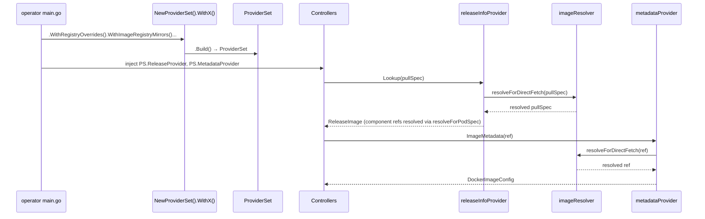

# Unified Image Resolution

## Summary

Refactor HyperShift's registry override and image resolution code into a single `support/imageresolution/` package with a unified `ProviderSet` factory. Today this logic is scattered across four packages with roughly fifteen types, two separate override mechanisms (`--registry-overrides` and ICSP/IDMS) implemented through different code paths, and no mechanical enforcement of abstraction boundaries. The result is that surgical fixes to registry override handling keep missing spots (see OCPBUGS-83564), and engineers describe the code as "a huge mess" they are reluctant to touch.

This enhancement consolidates all image resolution behind a single abstraction that all operators and controllers use, adds a `go/analysis` linter to enforce the boundary, and preserves the existing consumer API so controllers require no changes. A builder API (`NewProviderSet().WithX().Build()`) is the only exported construction entry point — all internal types (resolver, fetcher, cache) are private.

## Motivation

As HyperShift expands to more non-OpenShift management clusters (AKS for ARO-HCP, and potentially others), the `--registry-overrides` flag — originally introduced for environments without ICSP/IDMS support — becomes increasingly important. The current code makes it structurally easy to miss applying these overrides in new controllers and code paths.

The problems are:

- **Inconsistent override application.** `--registry-overrides` is not honored in all controllers. OCPBUGS-83564 demonstrates this with nightly releases on non-OpenShift management clusters. Conversely, OCPBUGS-44470 demonstrates the opposite problem: `--registry-overrides` from the management cluster leaking into data plane components (CSI drivers, konnectivity-agent), causing worker nodes to pull from management-cluster-specific registries.
- **Duplicated logic.** CLI overrides are applied in `RegistryMirrorProviderDecorator`, ICSP/IDMS overrides are applied in both `ProviderWithOpenShiftImageRegistryOverridesDecorator` (for release pullspecs) and `SeekOverride()` in `RegistryClientImageMetadataProvider` (for image metadata). These are separate implementations of similar logic.
- **Confusing interface hierarchy.** The `Provider` -> `ProviderWithRegistryOverrides` -> `ProviderWithOpenShiftImageRegistryOverrides` tower in `releaseinfo` couples override concerns with lookup concerns and produces type names exceeding 50 characters.
- **No enforcement.** Nothing prevents new code from handling image references without applying overrides. Engineers and AI agents both miss spots due to the codebase size.

This also aligns with the broader CNTRLPLANE-2791 effort to make the codebase more agent-readable. CPOV2 has demonstrated that clean, well-structured abstractions dramatically improve AI agent output quality.

### User Stories

- As a HyperShift developer, I want a single package that owns all image resolution logic so that when I need to understand or modify how images are resolved, I only need to look in one place.
- As a HyperShift developer implementing a new controller, I want the linter to tell me if I'm bypassing the image resolution abstraction so that I don't accidentally introduce a bug like OCPBUGS-83564.
- As an ARO-HCP operator deploying on AKS (a non-OpenShift management cluster), I want `--registry-overrides` to be honored consistently across all code paths so that I can use nightly release images without hitting resolution failures.
- As a platform team managing HyperShift at scale, I want the image resolution code to be well-tested and unified so that I can confidently upgrade without worrying about registry override regressions.

### Goals

1. Consolidate all registry override and image resolution logic into a single `support/imageresolution/` package.
2. Provide a builder API (`NewProviderSet().WithX().Build()`) as the only exported construction API, with a `ForDataPlane()` preset that enforces the safety invariant against management-cluster override leakage. Internal resolution uses purpose-specific methods (`resolveForDirectFetch`, `resolveForPodSpec`) so that every internal call site documents whether it is resolving for direct registry fetch or for a pod on the management cluster.
3. Preserve the existing consumer API (`imageprovider.ReleaseImageProvider`, `util.ImageMetadataProvider`) so that controllers require no changes.
4. Include a `go/analysis` linter that flags raw registry override parameters, direct registry client imports, and override-related string manipulation outside the `imageresolution/` package.
5. Resolve OCPBUGS-83564 structurally — make it impossible to obtain an unresolved image reference through the standard APIs.
6. Ensure all components are fully unit-testable through injected interfaces with no dependency on real container registries.

### Non-Goals

1. Changing the `--registry-overrides` CLI flag format or semantics. The flag works the same way; only the internal implementation changes.
2. Modifying the HostedControlPlane API or `ImageContentSources` spec field. ICSP/IDMS data continues to flow through the HCP spec as today.
3. Refactoring the HC controller or HCCO beyond what is necessary to wire up the new image resolution package. Broader HC controller and HCCO refactoring is tracked under CNTRLPLANE-3294.

## Proposal

Replace the current scattered image resolution implementation with a single `support/imageresolution/` package. The package exposes a builder API — `NewProviderSet().WithX().Build()` — as the only exported construction entry point. All internal types (resolver, fetcher, cache) are unexported.

**Exported surface:**

1. **`NewProviderSet()`** — Returns a `*ProviderSetBuilder`. The builder
   groups co-dependent parameters into named methods and validates
   combinations at `Build()` time:

   - `WithRegistryOverrides(overrides map[string]string)` — CLI `--registry-overrides`
   - `WithImageRegistryMirrors(mirrors map[string][]string)` — static ICSP/IDMS mirrors (from CLI/env). Mutually exclusive with `WithDynamicImageRegistryMirrors`.
   - `WithDynamicImageRegistryMirrors(client client.Client, interval time.Duration)` — dynamic ICSP/IDMS refresh from management cluster API. Groups the co-dependent client + refresh interval. Mutually exclusive with `WithImageRegistryMirrors`.
   - `WithImageOverrides(overrides map[string]string)` — `--image-overrides` component map
   - `WithCache()` — enables caching of resolved references and release payloads
   - `ForDataPlane()` — preset for data-plane providers. Enforces the safety invariant that management-cluster overrides must never leak to the data plane (ref OCPBUGS-44470). `Build()` rejects contradictions — e.g., `ForDataPlane().WithRegistryOverrides(...)` returns a build error. This distinguishes "intentionally no overrides" from "forgot to configure".
   - `Build()` — validates the configuration and returns `(*ProviderSet, error)`.

2. **`ProviderSet`** — A struct with typed fields:
   - `ReleaseProvider` — implements `releaseinfo.Provider`
   - `MetadataProvider` — implements `util.ImageMetadataProvider`
   - `ComponentProvider` — implements `imageprovider.ReleaseImageProvider`
   - `Config()` — returns the serializable `ResolverConfig` for propagation to child operator deployments

3. **`ResolverConfig`** — Serializable configuration with helper methods (`RegistryOverridesFlag()`, `ImageRegistryMirrorsEnvVar()`) for propagation to child deployments.

4. **Linter** — A `go/analysis` analyzer that flags bypass of the abstraction: raw override map parameters, direct registry client imports, and override-related string replacement outside the allowed package.

**Internal (unexported) types:**

- `imageResolver` — purpose-specific resolution methods (`resolveForDirectFetch`, `resolveForPodSpec`)
- `releaseInfoProvider` — replaces the decorator chain; fetches release payloads via `resolveForDirectFetch`, resolves component images via `resolveForPodSpec`, applies `--image-overrides`
- `componentProvider` — pure lookup table over resolved `ReleaseImage`
- `metadataProvider` — resolves image refs via `resolveForDirectFetch` before fetching metadata
- `configSource` / `managementClusterConfigSource` — dynamic ICSP/IDMS refresh

### Workflow Description

This enhancement changes internal implementation only. There is no user-facing workflow change. The `--registry-overrides` flag continues to work identically. ICSP/IDMS resources on OpenShift management clusters continue to be honored.

**Developer workflow changes:**

1. When a developer adds a new controller that needs to resolve images, they obtain images from `ReleaseImageProvider.GetImage()` or `ImageMetadataProvider.ImageMetadata()`, which return already-resolved references. Controllers never call resolution methods directly — the providers handle it internally.
2. If a developer attempts to handle registry overrides directly (e.g., accepting a `registryOverrides` map parameter, importing registry client libraries, or doing string replacement on image references), the linter fails CI with a clear error message pointing them to the `imageresolution` package.

**Operator initialization:**



### API Extensions

This enhancement does not add or modify any CRDs, admission webhooks, conversion webhooks, aggregated API servers, or finalizers. It is a purely internal refactoring.

### Topology Considerations

#### Hypershift / Hosted Control Planes

This enhancement is entirely within the HyperShift codebase. It affects all topologies equally since the image resolution code is shared infrastructure used by all platforms.

Key considerations:

- The management cluster operators (hypershift-operator, ignition-server, karpenter-operator) and hosted control plane operators (control-plane-operator) all construct their own `ProviderSet` from their respective CLI flags via `NewProviderSet()`.
- Override configuration is propagated from management cluster to hosted control plane via three mechanisms, all unchanged:
  - `--registry-overrides` CLI flag on CPO deployment
  - `OPENSHIFT_IMG_OVERRIDES` env var on CPO, HCCO, and ignition-server deployments (carries ICSP/IDMS mirrors)
  - `ImageContentSources` field on the HCP spec
- Non-OpenShift management clusters (AKS) benefit most from this change, as consistent `--registry-overrides` application is the primary bug fix.

#### Standalone Clusters

Not directly applicable. HyperShift is a hosted control plane solution and does not run on standalone clusters. However, standalone OpenShift clusters used as management clusters will continue to have their ICSP/IDMS resources honored through the unified image resolution package.

#### Single-node Deployments or MicroShift

Not applicable. This enhancement does not affect single-node deployments or MicroShift. It is internal to the HyperShift operator and control plane operator binaries.

#### OpenShift Kubernetes Engine

Not applicable. This enhancement does not depend on features excluded from OKE, nor does it change any OKE-relevant behavior.

### Implementation Details/Notes/Constraints

#### Package Layout

```
support/imageresolution/
    provider_set.go       // NewProviderSet, ProviderSetBuilder, ProviderSet (exported API)
    config.go             // ResolverConfig, serialization helpers (exported)
    resolver.go           // imageResolver (unexported)
    release.go            // releaseInfoProvider (unexported)
    component.go          // componentProvider (unexported)
    metadata.go           // metadataProvider (unexported)
    cache.go              // instance-level caches (unexported)
    registry_client.go    // registry I/O (unexported)
    config_source.go      // configSource, managementClusterConfigSource (unexported)
    lint/
        analyzer.go
        analyzer_test.go
        cmd/
            main.go
```

#### Construction API: ProviderSet Builder

The package exposes a builder API. All internal types are unexported —
consumers interact only with the builder, the `ProviderSet` return
type, and the familiar provider interfaces. The builder groups
co-dependent parameters into named methods and validates combinations
at `Build()` time.

```go
// ProviderSetBuilder configures and constructs image resolution
// infrastructure. Created via NewProviderSet().
type ProviderSetBuilder struct { /* unexported fields */ }

func NewProviderSet() *ProviderSetBuilder

func (b *ProviderSetBuilder) WithRegistryOverrides(overrides map[string]string) *ProviderSetBuilder
func (b *ProviderSetBuilder) WithImageRegistryMirrors(mirrors map[string][]string) *ProviderSetBuilder
func (b *ProviderSetBuilder) WithDynamicImageRegistryMirrors(client client.Client, interval time.Duration) *ProviderSetBuilder
func (b *ProviderSetBuilder) WithImageOverrides(overrides map[string]string) *ProviderSetBuilder
func (b *ProviderSetBuilder) WithCache() *ProviderSetBuilder
func (b *ProviderSetBuilder) ForDataPlane() *ProviderSetBuilder
func (b *ProviderSetBuilder) Build() (*ProviderSet, error)

// ProviderSet is the return type of Build(). It provides all typed
// providers that controllers need.
type ProviderSet struct {
    ReleaseProvider    releaseinfo.Provider
    MetadataProvider   util.ImageMetadataProvider
    ComponentProvider  imageprovider.ReleaseImageProvider
}

// Config returns the serializable resolver configuration for
// propagation to child operator deployments.
func (ps *ProviderSet) Config() ResolverConfig
```

`Build()` validates the configuration and returns an error for invalid
combinations:
- `WithImageRegistryMirrors` and `WithDynamicImageRegistryMirrors` are
  mutually exclusive (static vs dynamic ICSP/IDMS)
- `ForDataPlane()` rejects `WithRegistryOverrides`,
  `WithImageRegistryMirrors`, `WithDynamicImageRegistryMirrors`, and
  `WithImageOverrides` — management-cluster overrides must never leak
  to the data plane

Example initialization across all operators:

```go
// === HyperShift Operator (HO) — dynamic ICSP/IDMS refresh ===
hoProviders, err := imageresolution.NewProviderSet().
    WithRegistryOverrides(cliOverrides).
    WithDynamicImageRegistryMirrors(mgmtClient, 30*time.Second).
    WithCache().
    Build()

// === Control Plane Operator (CPO) — control plane ===
cpProviders, err := imageresolution.NewProviderSet().
    WithRegistryOverrides(cliOverrides).
    WithImageRegistryMirrors(icspIdms).
    WithImageOverrides(componentImages).
    WithCache().
    Build()

// === Control Plane Operator (CPO) — data plane ===
dpProviders, err := imageresolution.NewProviderSet().
    ForDataPlane().
    WithCache().
    Build()
```

The `ForDataPlane()` preset makes the safety invariant explicit:
this is not "empty config" — it is an intentional declaration that no
management-cluster overrides should be applied. `Build()` enforces
this at construction time, preventing accidental configuration like
`ForDataPlane().WithRegistryOverrides(...)`.

Controllers receive the typed providers from the `ProviderSet`:

```go
reconciler := &HostedControlPlaneReconciler{
    ReleaseProvider:      cpProviders.ReleaseProvider,
    UserReleaseProvider:  dpProviders.ReleaseProvider,
    ImageMetadataProvider: cpProviders.MetadataProvider,
}
```

#### Resolver Config and Serialization

```go
type ResolverConfig struct {
    RegistryOverrides   map[string]string
    ImageRegistryMirrors map[string][]string
}

// RegistryOverridesFlag serializes CLI overrides to the --registry-overrides format: "src1=dst1,src2=dst2"
func (c ResolverConfig) RegistryOverridesFlag() string

// ImageRegistryMirrorsEnvVar serializes ICSP/IDMS overrides to the OPENSHIFT_IMG_OVERRIDES env var format
// used by child operator deployments.
func (c ResolverConfig) ImageRegistryMirrorsEnvVar() string
```

#### Internal: imageResolver

The `imageResolver` is an unexported type that implements purpose-specific
resolution methods used internally by the providers. Controllers never
interact with it directly.

**Method semantics:**

Both methods apply CLI `--registry-overrides` first (prefix
replacement, no network I/O). `resolveForDirectFetch` additionally
applies ICSP/IDMS mirrors (try mirrors in order, verify availability
with timeout). `resolveForPodSpec` does not apply ICSP/IDMS because on
OpenShift management clusters the container runtime handles mirror
policies natively; on non-OpenShift management clusters there are no
ICSP/IDMS policies.

| Method | CLI overrides | ICSP/IDMS | Use when |
|---|---|---|---|
| `resolveForDirectFetch` | Yes | Yes | Provider fetches from registry |
| `resolveForPodSpec` | Yes | No | Image ref goes into a pod spec on mgmt cluster |
| *(no call)* | — | — | Image ref is placed on the data plane |

Data plane images are not resolved through the resolver. They pass
through unmodified — worker nodes handle their own mirror resolution
via IDMS from `HCP.spec.ImageContentSources`.

Error handling: Neither method returns an error for override matching
failures. If all ICSP/IDMS mirrors are unavailable,
`resolveForDirectFetch` falls through to the original reference
(preserving existing behavior). Errors are reserved for malformed
input references. Mirror failures are logged but not propagated.

Matching strategy: Both methods use structured `DockerImageReference`
parsing with three match strategies (root registry, namespace, exact
repository), replacing the naive `strings.Replace` used by the current
`RegistryMirrorProviderDecorator`. This is a behavioral improvement —
structured matching is more correct and is already used by
`SeekOverride()`.

#### Image Resolution Use Cases

Image resolution behaves differently depending on where the resolved
reference will be consumed and what kind of cluster is doing the
resolving. The internal resolver must handle each case correctly.

**Use case 1 — Management cluster is OpenShift:**

- *Pods on the management cluster* can use unmodified image references
  from the release payload. The container runtime on an OpenShift
  management cluster already honours the cluster's own ICSP/IDMS
  policies, so explicit mirror resolution is unnecessary for pod specs.
  `--registry-overrides` (CLI overrides) still take precedence when
  present.
- *Direct registry access* (e.g., fetching release payload metadata or
  image configs) must resolve references through the management
  cluster's ICSP/IDMS policies, because the code performing the fetch
  runs on the management cluster and must reach a reachable mirror.
  `--registry-overrides` take precedence here as well.

**Use case 2 — Management cluster is not OpenShift (e.g., AKS):**

- There are no ICSP/IDMS policies on the management cluster.
  `--registry-overrides` is the only override mechanism and is applied
  to both pod specs and direct registry access.

**Use case 3 — Data plane (hosted cluster worker nodes):**

- All images placed on the data plane come unmodified from the release
  payload. Registry mirror resolution for the data plane is handled by
  the IDMS resources laid down on worker nodes via ignition, sourced
  from `HCP.spec.ImageContentSources`. The management cluster's
  ICSP/IDMS and `--registry-overrides` must never be applied to data
  plane image references.

The internal resolver enforces this distinction: `resolveForDirectFetch()`
for direct registry fetch, `resolveForPodSpec()` for pod execution on
the management cluster, and no resolver call for data plane placement.
The method name documents the intent, making it impossible to confuse
the use cases. At the consumer level, the `ProviderSet` construction
config makes the distinction explicit — a data-plane `ProviderSet` is
constructed with an empty config, so no overrides can leak.

#### Management Cluster vs Data Plane Resolution

The CPO constructs two separate release providers with different
override configurations:

- **Control-plane provider** — uses `--registry-overrides` and the
  management cluster's ICSP/IDMS mirrors (for components that run on
  the management cluster or are fetched directly by the operator)
- **User/data-plane provider** — does NOT use `--registry-overrides`,
  and does NOT use the management cluster's ICSP/IDMS mirrors (data
  plane components must use unmodified pullspecs — worker nodes handle
  their own mirror resolution via IDMS from `ImageContentSources`)

Management cluster ICSP/IDMS and data plane IDMS come from different
sources: the management cluster's ICSP/IDMS are read from the
management cluster API (via `GetAllImageRegistryMirrors()`), while the
data plane's IDMS is sourced from `HCP.spec.ImageContentSources` and
written to worker nodes via ignition. These are independent
configurations.

The new design handles this through two `ProviderSet` instances built
with different configurations. The control-plane set's internal
resolver applies CLI overrides + ICSP/IDMS; the data-plane set uses
the `ForDataPlane()` preset, which enforces that no overrides are
applied and rejects contradictions at build time:

```go
// CPO main.go
cpProviders, _ := imageresolution.NewProviderSet().
    WithRegistryOverrides(registryOverrides).
    WithImageRegistryMirrors(mgmtClusterMirrors). // from management cluster ICSP/IDMS
    WithImageOverrides(componentImages).
    WithCache().
    Build()

// Data plane: ForDataPlane() enforces no overrides, no mirrors.
// Worker nodes handle their own IDMS from HCP.spec.ImageContentSources.
dpProviders, _ := imageresolution.NewProviderSet().
    ForDataPlane().
    WithCache().
    Build()

reconciler := &HostedControlPlaneReconciler{
    ReleaseProvider:       cpProviders.ReleaseProvider,
    UserReleaseProvider:   dpProviders.ReleaseProvider,
    ImageMetadataProvider: cpProviders.MetadataProvider,
}
```

Inside the providers, the resolution method names document the intent:
`resolveForDirectFetch(ref)` when fetching release payload metadata,
`resolveForPodSpec(ref)` when building a container spec for the
management cluster, and no resolver call for data plane images. This
preserves the existing invariant: management-cluster overrides and
mirror policies must never leak to the data plane. An integration test
verifying this invariant is included in the test plan.

#### Dynamic ICSP/IDMS Refresh

The current `CommonRegistryProvider.Reconcile()` in `globalconfig` periodically refreshes ICSP/IDMS mirrors from the management cluster by mutating provider state at runtime. The new design handles this through an internal `configSource` interface:

```go
// configSource provides dynamic resolver configuration that can be
// refreshed from the management cluster. Unexported — consumers use
// WithDynamicImageRegistryMirrors() on the builder instead.
type configSource interface {
    current(ctx context.Context) (ResolverConfig, error)
}
```

The internal resolver calls `configSource.current()` on each resolution invocation to pick up ICSP/IDMS changes. The implementation caches the management cluster state and refreshes it on a configurable interval.

When `WithImageRegistryMirrors()` is used (CPO, ignition-server, karpenter — they get config via CLI flags at startup), `Build()` uses a static config source wrapping an immutable `ResolverConfig`.

When `WithDynamicImageRegistryMirrors()` is used (HO), `Build()` constructs a `managementClusterConfigSource` that fetches ICSP/IDMS from the management cluster, merges with CLI overrides, and caches the result with the configured refresh interval:

```go
// HO main.go — dynamic refresh via builder
hoProviders, err := imageresolution.NewProviderSet().
    WithRegistryOverrides(cliOverrides).
    WithDynamicImageRegistryMirrors(mgmtClient, 30*time.Second).
    WithCache().
    Build()
```

#### Testability

All registry I/O is behind injectable interfaces:

| Interface | Purpose | Test Fake |
|---|---|---|
| `MirrorAvailabilityChecker` | Mirror reachability | Canned `available` map |
| `ReleaseFetcher` | Release payload I/O | Canned release payloads |
| `ImageMetadataFetcher` | Image metadata I/O | Canned image configs |

The `ProviderSet` can be constructed with test-friendly builder configurations (e.g., `NewProviderSet().ForDataPlane().Build()` or a minimal builder with no options), and individual providers can be replaced with test doubles since controllers depend on interfaces (`releaseinfo.Provider`, `util.ImageMetadataProvider`), not concrete types.

All caches accept TTL as a constructor parameter, enabling zero-TTL caches in tests for uncached behavior and pre-populated caches for cache-hit paths. All caches are instance-level (not global variables), so each resolver and provider instance has its own independent cache state. This eliminates the current global cache problem in `imagemetadata.go` where `mirrorCache`, `imageMetadataCache`, `manifestsCache`, and `digestCache` are package-level variables that make testing non-deterministic.

#### Type Migration

| Old Type | Old Package | New Type | Fate |
|---|---|---|---|
| `Provider` | `releaseinfo` | `ReleaseInfoProvider` | Rebuilt |
| `ProviderWithRegistryOverrides` | `releaseinfo` | -- | Deleted |
| `ProviderWithOpenShiftImageRegistryOverrides` | `releaseinfo` | -- | Deleted |
| `RegistryClientProvider` | `releaseinfo` | unexported | Internalized |
| `CachedProvider` | `releaseinfo` | unexported | Generalized |
| `RegistryMirrorProviderDecorator` | `releaseinfo` | -- | Deleted |
| `ProviderWithOpenShiftImageRegistryOverridesDecorator` | `releaseinfo` | -- | Deleted |
| `StaticProviderDecorator` | `releaseinfo` | -- | Absorbed into `ReleaseInfoProvider` |
| `ReleaseImageProvider` | `imageprovider` | **kept** | Consumer interface |
| `SimpleReleaseImageProvider` | `imageprovider` | `ComponentProvider` | Rebuilt |
| `ImageMetadataProvider` | `util` | **kept** | Consumer interface |
| `RegistryClientImageMetadataProvider` | `util` | `MetadataProvider` | Rebuilt |
| `MirrorAvailabilityCache` | `util` | unexported | Instance-level in `cache.go` |
| `RegistryProvider` | `globalconfig` | -- | Deleted (replaced by `ConfigSource`) |
| `CommonRegistryProvider` | `globalconfig` | -- | Deleted (replaced by `ManagementClusterConfigSource`) |

**Functions consolidated:**
- `ConvertImageRegistryOverrideStringToMap()` from `util/util.go` -> `config.go`
- `ConvertRegistryOverridesToCommandLineFlag()` from `util/util.go` -> `ResolverConfig.RegistryOverridesFlag()`
- `ConvertOpenShiftImageRegistryOverridesToCommandLineFlag()` from `util/util.go` -> `ResolverConfig.ImageRegistryMirrorsEnvVar()`
- `SeekOverride()` / `GetRegistryOverrides()` from `util/imagemetadata.go` -> `resolveForDirectFetch()` (internal to providers)
- `NewCommonRegistryProvider()` from `globalconfig/imagecontentsource.go` -> `NewProviderSet().WithDynamicImageRegistryMirrors()`

Note: `StaticProviderDecorator` (used for `--image-overrides` in CPO and HCCO) is absorbed into `ReleaseInfoProvider`. The `--image-overrides` overlay is applied as a final step after release payload fetch and registry resolution, before caching. This keeps all image resolution — both registry-level and component-level — in a single package.

Net reduction: ~16 types across 4 packages to ~7 types in 1 package plus 2 preserved consumer interfaces.

#### Linter Rules

The `go/analysis` analyzer flags four categories:

1. **Raw override map parameters** outside `imageresolution/` — function parameters or struct fields matching `registryOverrides map[string]string` or `imageRegistryMirrors map[string][]string`.
2. **Direct registry client imports** outside `imageresolution/` — imports of `go-containerregistry/pkg/v1/remote`, `containers/image`, etc.
3. **Override-related string replacement** outside `imageresolution/` — `strings.Replace` calls in contexts suggesting image/registry manipulation (heuristic, variable-name-based).
4. **Override getter method calls** outside `imageresolution/` — calls to `GetRegistryOverrides()`, `GetOpenShiftImageRegistryOverrides()`, or `GetMirroredReleaseImage()` on provider interfaces. These methods are the primary mechanism by which override configuration leaks out of the release provider into other code. In the new architecture, `ProviderSet.Config()` is the single approved way to obtain override configuration.

Test files and the `imageresolution/` package itself are allowlisted.

#### Migration Strategy

The migration is structured as four independently shippable and revertible PRs:

**PR 1: New package.** Create `support/imageresolution/` with the builder API, `ProviderSet`, and internal implementations. Port logic from the decorator chain and `SeekOverride()` into the internal resolver. Full unit test coverage including `ForDataPlane()` validation. No callers yet.

**PR 2: Wire operator entrypoints and test fakes.** Update all four operator `main.go` files to use the builder API. Create adapter constructors so controllers see no API change. Update `releaseinfo/fake/fake.go` and test infrastructure (referenced by 42+ test files) to work with the new types. Both old and new code may coexist briefly for parity verification.

**PR 3: Migrate remaining consumers.** Move `support/catalogs/images.go` to use `ProviderSet.Config()` for registry discovery (see Catalog Images section below). Move ICSP/IDMS config fetching to the internal `managementClusterConfigSource`. Move HC controller override propagation to use `providerSet.Config().RegistryOverridesFlag()` and `providerSet.Config().ImageRegistryMirrorsEnvVar()`. Consolidate `OPENSHIFT_IMG_OVERRIDES` env var serialization/deserialization utilities.

**PR 4: Delete old code + add linter.** Remove the decorator chain, interface tower, `SeekOverride()`, `GetRegistryOverrides()`, `GetOpenShiftImageRegistryOverrides()`, `CommonRegistryProvider`, and related utilities. Add the `go/analysis` linter to `make lint`.

### Risks and Mitigations

**Risk: Behavioral regression in override resolution.** The override resolution logic is being reimplemented in a new location. Subtle differences in ordering, matching, or fallback behavior could cause regressions.

Mitigation: Comprehensive unit tests for the internal `resolveForDirectFetch()` and `resolveForPodSpec()` methods covering all current matching strategies (root registry, namespace, exact repository). The migration plan includes a parity verification phase where both old and new paths can run simultaneously.

**Risk: Large refactoring across core infrastructure.** Image resolution is used by every controller. A mistake could affect all hosted clusters.

Mitigation: The consumer API is preserved, so controllers don't change. The blast radius is confined to infrastructure code in `support/` and operator `main.go` files. Each of the four migration PRs is independently revertible.

**Risk: Management-cluster overrides leaking to data plane.** The CPO constructs two release providers: one with CLI overrides (control plane) and one without (user/data plane). Getting this wrong silently propagates management-cluster-specific pullspecs to worker nodes. This has happened before — OCPBUGS-44470 reported `--registry-overrides` from the HO leaking to data plane daemonsets (CSI drivers, konnectivity-agent, iptables-alerter).

Mitigation: The `ForDataPlane()` builder preset makes the intent explicit and enforces it at build time — `Build()` rejects contradictions like `ForDataPlane().WithRegistryOverrides(...)`, distinguishing "intentionally no overrides" from "forgot to configure." Internally, the purpose-specific methods (`resolveForDirectFetch`, `resolveForPodSpec`, and no call for data plane) reinforce this. An integration test verifies that `dpProviders.ReleaseProvider` output does NOT contain management-cluster override prefixes. This is the highest-risk behavioral invariant and gets dedicated test coverage.

**Risk: Linter false positives.** Linter rule 3 (the string replacement heuristic) may flag legitimate code that happens to use `strings.Replace` near variables named `image` or `registry`.

Mitigation: Start with the more precise linter rules (rule 1: raw override maps, rule 2: direct registry imports) and tune rule 3 based on CI experience. The analyzer supports an allowlist for exceptional cases.

### Drawbacks

- **Large diff across core infrastructure.** Even though the consumer API is stable, the internal wiring changes are substantial. This will require careful review and testing.
- **Temporary code duplication.** During the migration, both old and new implementations will exist. This is intentional for parity verification but adds short-term complexity.
- **Learning curve.** Engineers familiar with the current decorator chain will need to learn the new structure. However, the new structure is simpler (fewer types, clearer names), so this cost is low.

## Alternatives (Not Implemented)

### Override Engine Only

Extract only the override/resolution concern into a new `support/imageoverride/` package, leaving the existing `releaseinfo`, `imageprovider`, and `util` packages in place with their current structures but injecting the shared override engine.

This was rejected because it doesn't address the full problem: types remain scattered across packages, the confusing interface hierarchy stays, and the "where does image resolution live?" question still has multiple answers. The linter boundary is also harder to define with multiple allowed packages.

### Pipeline Architecture

Model the entire image resolution flow as composable middleware stages: `Ref -> Resolve -> Fetch -> Transform -> Result`. Override resolution would be one stage.

This was rejected as over-engineered. The actual problem has two override sources and three consumers. A pipeline abstraction adds indirection without proportional benefit.

#### Catalog Images

`support/catalogs/images.go` uses ICSP/IDMS overrides differently from standard image resolution. It does not resolve a known pullspec; instead it uses override configuration to discover which registries to probe when constructing OLM catalog image URLs from scratch (e.g., finding mirrors for `registry.redhat.io`).

This is a different usage pattern from resolution. Catalog image construction uses `ProviderSet.Config()` to obtain the override maps, then performs its own registry discovery logic. It does not use the resolution methods. The linter allowlists this specific usage of `Config()` in the catalogs package.

#### Controller Struct Field Types

The HC controller and HCP controller currently declare their release provider fields using the interface type `releaseinfo.ProviderWithOpenShiftImageRegistryOverrides` (not the base `Provider`), because they call `GetRegistryOverrides()` and `GetOpenShiftImageRegistryOverrides()` for serialization. Once these getter methods move to `ProviderSet.Config()`, these controller fields change to accept the simpler `releaseinfo.Provider` interface. The `ProviderSet` itself (or its `Config()` method) is injected as a separate field for serialization. This is a controller struct type change but not a consumer API change — the methods controllers call (`GetImage()`, `ImageMetadata()`) are unchanged.

#### `RegistryProvider` Interface Elimination

The `globalconfig.RegistryProvider` interface (providing `GetMetadataProvider()`, `GetReleaseProvider()`, and `Reconcile()`) is eliminated. The mermaid diagram above shows `main.go` constructing providers via the builder. The `Reconcile()` lifecycle is replaced by `WithDynamicImageRegistryMirrors()` which internally manages refresh.

## Open Questions

1. What is the right granularity for linter rule 3 (string replacement heuristic)? This may need tuning after the initial implementation based on false positive rates.

2. Should `ManagementClusterConfigSource` refresh on a fixed interval, or should it be triggered by informer events on ICSP/IDMS resources? The current `Reconcile()` pattern runs on every HC reconciliation. A fixed interval is simpler but may be slower to pick up changes.

## Test Plan

<!-- TODO: Finalize test labels and CI integration once the implementation is underway. -->

### Unit Tests

All components are unit-testable through injected interfaces:

- **`resolveForDirectFetch()` and `resolveForPodSpec()`**: Tests covering CLI override matching, ICSP/IDMS mirror failover (direct fetch only), combined CLI + ICSP/IDMS behavior, digest and tag preservation, no-match passthrough, and verification that `resolveForPodSpec` does not apply ICSP/IDMS.
- **`releaseInfoProvider.Lookup()`**: Tests for release pullspec resolution via `resolveForDirectFetch`, component image resolution via `resolveForPodSpec`, `--image-overrides` application, caching behavior, and error propagation.
- **`componentProvider`**: Tests for successful lookups, missing image tracking, version and component image map access.
- **`metadataProvider`**: Tests for image reference resolution before fetch, caching, and error propagation.
- **Dual-ProviderSet invariant**: Test that a `ProviderSet` built with `ForDataPlane()` returns component images without management-cluster override prefixes. Test that `ForDataPlane().WithRegistryOverrides(...)` returns a build error. This verifies the management-cluster vs data-plane separation.
- **Dynamic config refresh**: Tests for `managementClusterConfigSource` returning updated config after ICSP/IDMS changes on the management cluster.
- **Linter**: Tests using `analysistest.Run()` with testdata fixtures covering all four flag categories and allowlist behavior.

### Integration Tests

- Parity verification during migration: run both old and new code paths and compare results.

### E2E Tests

- Verify `--registry-overrides` on a non-OpenShift management cluster (AKS) with nightly release images.
- Verify ICSP/IDMS on an OpenShift management cluster.

## Graduation Criteria

<!-- TODO: Define graduation milestones per dev-guide/feature-zero-to-hero.md requirements once targeted at a release. -->

This enhancement is an internal refactoring with no user-facing feature change. It does not require feature gates or graduation through Dev Preview / Tech Preview / GA stages. The refactoring is complete when:

1. All image resolution goes through `imageresolution/`.
2. The old decorator chain and interface tower are deleted.
3. The linter is integrated into `make lint`.
4. OCPBUGS-83564 is verified resolved.

### Dev Preview -> Tech Preview

Not applicable. This is an internal refactoring with no feature gate.

### Tech Preview -> GA

Not applicable. This is an internal refactoring with no feature gate.

### Removing a deprecated feature

Not applicable.

## Upgrade / Downgrade Strategy

This enhancement changes internal implementation only. There are no changes to stored state, API objects, or configuration formats. The `--registry-overrides` flag format is unchanged.

- **Upgrade:** No action required. The new code resolves images identically to the old code.
- **Downgrade:** No action required. The old code can be reverted to without data migration.

## Version Skew Strategy

During an upgrade, the hypershift-operator and control-plane-operator may briefly run different versions. This is safe because:

- The override configuration is serialized to child operator deployments via CLI flags (`--registry-overrides`), env vars (`OPENSHIFT_IMG_OVERRIDES`), and HCP spec (`ImageContentSources`), all of which are unchanged.
- Each operator constructs its own `ProviderSet` from its own flags. There is no shared runtime state between operators for image resolution.

## Operational Aspects of API Extensions

Not applicable. This enhancement does not add or modify any API extensions.

## Support Procedures

Not applicable. This enhancement does not change any user-facing behavior, APIs, or operational procedures. Existing support procedures for `--registry-overrides` and ICSP/IDMS continue to apply.

## Infrastructure Needed

None.
